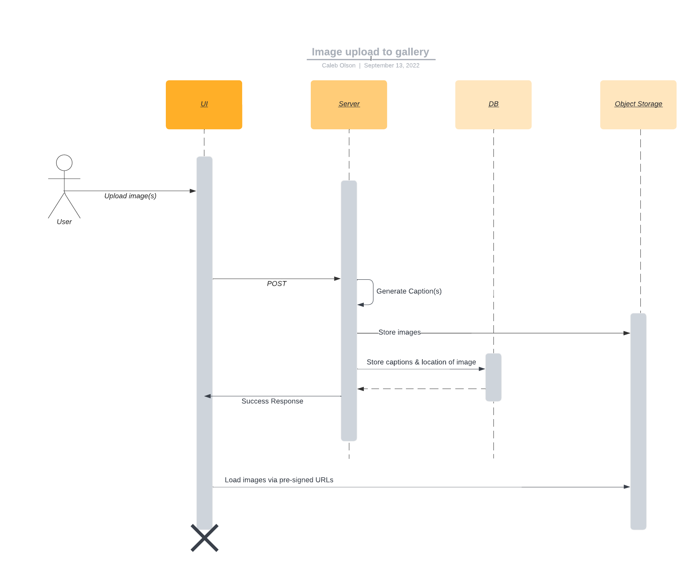

# Neural Image Gallery Challenge

This repo contains a full stack application satisfying the requirements detailed at the bottom of this document. The sequence diagram below provides an overview of the architecture and flow-of-data within the application. This implementation was timeboxed to 8 hours.

## Prerequisites
- Docker
- Yarn/NPM
  
## Run it

### Backend

The backend consists of a Django server, SQLite, and MinIO (for object storage). For ease of setup and local development, `docker compose` is used. From the root of the project, run:

`docker compose up`

And the following will happen:
- Django server boots up (port 8000)
- DB migrations are ran
- MinIO server is launched (port 9000)
- Transient container is launched which creates a MinIO bucket for local image storage

You're good to go, onto the frontend.
  

### Frontend

To launch the frontend, move into the `frontend` directory:

`cd frontend`

And install dependencies:

`yarn install`

Now launch it:

`yarn start`

### Downloading model weights

Depending on your setup, you may need to additionally run:

`git lfs pull`

To download model weights

  

## Requirements:

Challenge: Design a webapp that hosts a gallery of images along with a machine-learning generated caption for each image.

Requirements:
- Software shall display a gallery of images
- Software shall allow the user to upload new images to the gallery
- Software shall allow the user to delete images from the gallery
- Software shall determine the image caption using the ResNet50 model

Implementation guidelines:
- Use Keras's bundled ResNet model for running inferences
- Use git for version control. Form commits and commit messages following git best practices
- Use Python for the server backend. Use any framework and database you would like.
- Use React and TypeScript in the frontend
- Implementing users and authentication is optional. Feel free to add if you have time, but it’s not the focus of this exercise.

## Comments/Next steps

Given more time, what I would do next includes:
- Testing (unit, integration, and migration tests)
- Static type checking server side, and better typing in general
- linters front and back
- Auth
A couple notes:
- I chose to add an object storage service (MinIO) for storing larger unstructured data (images)
- I chose to use Django as the Python backend framework as an excuse to get exposed to it. This was my first time ever touching Django
- Within the app, image upload is intuitive enough. But to delete an image, just click on it
